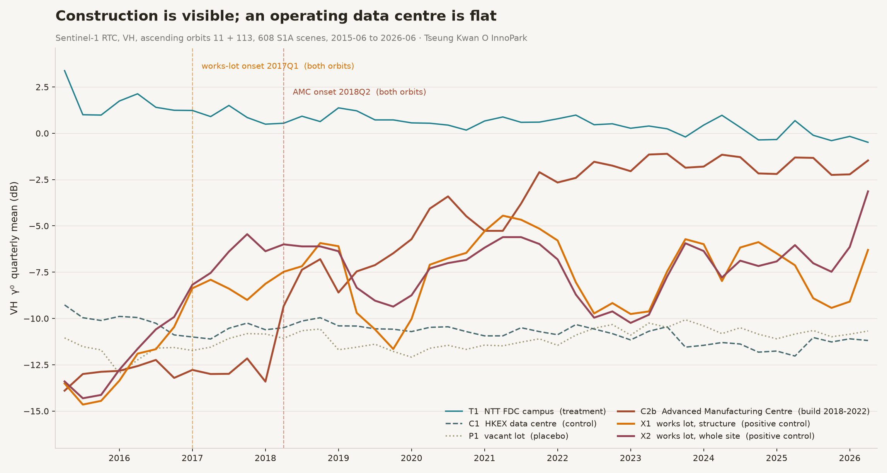

# Data centre construction, measured from radar — and checkable to the pixel

A working, reproducible measurement of construction activity at a data centre
cluster in Tseung Kwan O, Hong Kong, from 608 Sentinel-1 radar scenes spanning
eleven years.

Clone it and run `./run.sh`. No account, no API key, no licence. About a minute
later you will have the table below, computed from the same public scenes, or
you will have found something wrong with it. Both outcomes are the point.

```
git clone https://github.com/mcmanusresearch/tectonic-dc-public
cd tectonic-dc-public && ./run.sh
```

---

## Why this exists

Trillions in debt, insurance and supply-chain commitments are staked on data
centres being built on schedule. Several vendors will sell you an estimate of
what is happening on a site, built from licensed imagery and private models.
None of them will take you down to the pixel and show you the backscatter the
number came from.

Instruments used for settlement have to be checkable by the party who loses
money. That requires three things almost no commercial satellite product
offers: **input data anyone can re-obtain**, **a method fixed before the data is
read**, and **a published record of what the method gets wrong**. This repository
is a demonstration that all three are possible at once.

Sentinel-1 is free, all-weather, and archived back to 2014. Every scene ID
below can be downloaded by anyone, byte-identical, forever.

---

## Result

Sentinel-1A, ascending relative orbits 11 and 113, VH, 2015-06-15 to
2026-06-24. Six areas of interest: one operating data centre campus, one
operating data centre, one vacant lot, and three sites with construction during
the window.

The detection rule and every threshold in it are fixed in
[`protocol.md`](protocol.md). The rule runs **independently on each orbit**, and
a result is accepted only if both orbits return the same quarter.

| Area of interest | Role | Onset, orbit 11 | Onset, orbit 113 | Accepted | Rise |
|---|---|---|---|---|---|
| NTT FDC campus | operating data centre | none | none | — | −4.7 / +1.0 dB |
| HKEX data centre | operating data centre | none | none | — | −1.4 / −1.6 dB |
| Vacant lot | placebo | none | none | — | +0.2 / +2.0 dB |
| **Advanced Manufacturing Centre** | built 2018–2022 | **2018Q2** | **2018Q2** | **yes** | **+10.8 / +11.3 dB** |
| **Works lot, structure** | construction | **2017Q1** | **2017Q1** | **yes** | **+4.7 / +7.7 dB** |
| **Works lot, whole site** | construction | **2017Q1** | **2017Q1** | **yes** | **+6.1 / +7.8 dB** |

Three sites fire, three do not, and the split falls exactly along the
construction line. Both orbits agree to the quarter on all three detections.
No control or placebo crosses its threshold on either orbit in eleven years.



### The independently datable case

The Advanced Manufacturing Centre is the one site here with a published
completion date and a published site area, which makes it the only real test.

- The site polygon measures 26,268 m² against a published site area of
  27,145 m² ([Nikken Sekkei](https://www.nikken.co.jp/en/projects/logistics/advanced_manufacturing_centre.html)),
  a ratio of 0.97 — independent confirmation the parcel is the right one.
- Baseline 2015Q2–2018Q1 sits at −12.9 dB with a standard deviation of
  0.53–0.66 dB. Backscatter is stable to within a decibel for three years.
- 2018Q1 → 2018Q2 rises **+4.1 dB in a single quarter**, then ramps for four
  years to a plateau near −1.5 dB from 2022Q3 onward.
- The building completed in April 2022
  ([HKSTP](https://www.hkstp.org/en/park-life/news-and-events/news/hkstp-unveils-its-advanced-manufacturing-centre-amc-to-accelerate-researchtoindustry-propel-in),
  [Construction Plus Asia](https://www.constructionplusasia.com/hk/advanced-manufacturing-centre/)).
  The plateau begins in the same year.

Note what the onset date does **not** match. The architect states construction
"began in 2019" ([Wong Tung](https://www.wongtung.com/news/amc-televised-news-amc-televised-news/)),
about a year after the measured onset. Radar responds to ground disturbance and
early site works, not to the milestone a press release names. We could not find
a primary document giving the site-works start date, so this is consistent with
that interpretation rather than proof of it.

---

## What the method rejects

A measurement you can only see succeed is not evidence. Two results were thrown
out during this run, and both are more informative than the successes.

**A control that turned out to be a construction site.** The Advanced
Manufacturing Centre was originally selected as a *control* — an operating
industrial building assumed static. It was not; it was under construction
through the middle of the window. That was a site-selection error, and it was
caught by the measurement rather than by the analyst. The area of interest is
reclassified in the registry, and the error is recorded in the registry file
itself rather than quietly corrected.

**A large step with a high signal-to-noise ratio that is not an event.** An
earlier version of the analysis used a least-squares single-break scan. On the
NTT FDC campus it reported a −2.89 dB step at a signal-to-noise ratio of −4.10
on orbit 11 — comfortably past any plausible detection floor — while orbit 113
reported a step of the *opposite sign* at nearly the same date. There is no
event. The campus is drifting slowly downward, and a least-squares break
estimator will always fit a step to a drift, because a step is the only thing
it is allowed to fit.

That result is why the accepted rule is cross-orbit agreement rather than
effect size. Signal-to-noise alone would have published a construction event at
an operating data centre. Two independent look geometries would not both make
the same mistake in the same direction, and they didn't.

Full adjudication of every declared test, including the two still outstanding,
is in [`docs/VALIDATION.md`](docs/VALIDATION.md).

---

## What this does not do

- **It does not measure energisation, power draw, or utilisation.** C-band radar
  responds to geometry and moisture. There is no path from these series to
  whether a substation is live or a hall is loaded, and any claim otherwise
  would be unfounded.
- **It dates construction onset, not named milestones.** Resolution here is
  about one quarter, and the onset precedes the publicly stated start date at
  the one site where both exist.
- **It carries no detection claim for the NTT campus.** Both of its buildings
  were completed before or at the very start of the usable archive. Its value
  in this run is as an eleven-year stability record, nothing more.
- **The areas of interest are small.** The smallest is 67 pixels at 10 m. The
  works-lot result rests on two areas agreeing, not on either alone.
- **This run uses terrain-corrected gamma-nought, not sigma-nought.** Absolute
  levels are not comparable to sigma-nought products from other pipelines.
  Steps and contrasts within this run are, because every area of interest went
  through one identical pipeline.
- **One cluster, one city, one run.** Nothing here establishes that the method
  generalises. That is the next piece of work, not a claim being made now.

---

## Repository layout

```
protocol.md                 the frozen protocol: filters, thresholds, decision rule
aoi/registry_v2.geojson     locked polygons, roles, per-geometry SHA-256 hashes
src/01_inventory.py         scene search and sequential filter attrition
src/02_extract.py           fixed-grid read, linear-power AOI means
src/03_onset.py             onset test, cross-orbit agreement, QA assertions
src/04_chart.py             the chart above
results/                    every output, regenerated by run.sh
docs/VALIDATION.md          declared tests and how each one adjudicated
```

Each polygon carries a SHA-256 of its own geometry, and the registry carries a
hash over the set. `src/03_onset.py` asserts pixel-set stability and
acquisition parity and refuses to produce a result if either fails.

---

## Reproducing and disputing

Everything needed is public. If you re-run this and get different numbers, the
disagreement is resolvable rather than a matter of opinion — check
`results/candidate_pool.csv` for the scene list, `results/attrition.csv` for
what each filter removed, and the geometry hashes in the registry.

Corrections are welcome as issues or pull requests, including to the results.
Published misses are a feature of this project, not an embarrassment to be
managed.

---

## About

Built by [Philip McManus](https://github.com/mcmanusresearch) at
Tectonic Space — the independent, auditable measure of the world's data
centres, for lenders, insurers and investors. The method draws on doctoral
research in progress and is published here so it can be attacked.

Separate from and not part of that thesis, which concerns port activity.

**Licences.** Code under [MIT](LICENSE). Protocol, registry and results under
[CC-BY-4.0](LICENSE-DATA) — fork the method freely, keep the attribution.

**Data.** Contains modified Copernicus Sentinel data 2015-2026. Sentinel-1 RTC
products accessed via the
[Microsoft Planetary Computer](https://planetarycomputer.microsoft.com/dataset/sentinel-1-rtc),
which performs the radiometric terrain correction.
